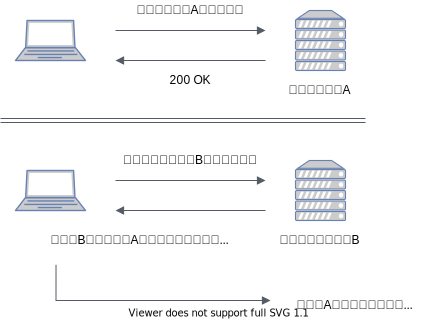

# クリックジャッキング攻撃

<!-- START doctoc -->
<!-- END doctoc -->

## 調査内容

クリックジャッキング攻撃とは、リンクやボタンといった要素を隠ぺいしてクリックを誘うことで、Webページの利用者の意図しない動作を誘発させようとする手法である。

具体的な攻撃の流れは以下になる。



では以下では、クリックジャッキングのようにボタンなどを偽装して意図しない操作を誘発させるデモを実装する。

なおクリックジャッキングのような攻撃手法とその対策に関しては、以下のIPA公式ページにまとめられている。

- [IPA 安全なウェブサイトの作り方](https://www.ipa.go.jp/security/vuln/websecurity.html)

## How to Reproduce ?

今回の実験では、簡易的にWebサーバ上でHTMLをServingするために、VSCodeの「[Live Server](https://marketplace.visualstudio.com/items?itemName=ritwickdey.LiveServer)」という拡張機能を使用している。

検証したいHTMLファイルを右クリックして、「Open With Live Server」を選択すれば動作検証が可能である。

以下の手順でクリックジャッキングの挙動を確認する。

1. `Live Server`で`normal-page.html`を開く
2. `Delete Account`ボタンを押す
   
   すると`Your Account has been deleted`と表示される
   これは以下のようにボタンの押下に対応する関数を発火させている

    ```html
    <button>
      Delete Account
    </button>

    <script>
      const btn = document.querySelector("button");
      btn.addEventListener("click", () => {
        alert("Your Account has been deleted");
      })
    </script>
    ```

3. `Click Jacking`というリンクから悪意のあるページに遷移する
4. `Click Here!`というボタンを押下する

   このボタンは本来なら以下の関数が発火されるはずである

    ```html
    <button>
      Click Here!
    </button>

    <script>
      const btn = document.querySelector("button");
      btn.addEventListener("click", () => {
        alert("You Clicked Here!");
      })
    </script>
    ```

5. 本来実装しているスクリプトではなく、遷移元の`Delete Account`が実行されていることを確認する

   これは以下のように遷移元ページを透過させた上で、ボタンをその下層のレイヤに配置しているためである。

    ```html
    <!-- ボタンの偽装 -->
    <button>
      Click Here!
    </button>

    <!-- 遷移元ページの要素を埋め込む -->
    <iframe src="normal-page.html"></iframe>

    <style>
      /** 埋め込みページを透過させる **/
      iframe {
        position: absolute;
        opacity: 0;
      }

      /** z-indexで埋め込みページの背景にボタンを配置する  **/
      button {
        position: absolute;
        top: 28px;
        left: 28px;
        z-index: -1;
      }
    </style>
    ```

これでクリックジャッキング攻撃のイメージをつけることができた。
