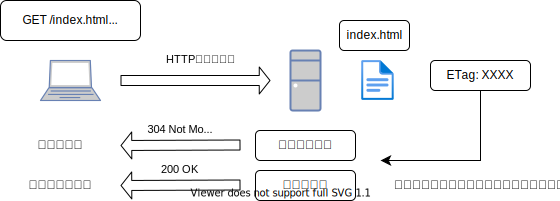

## 課題2 HTTPヘッダに関するクイズを作成する

<!-- START doctoc generated TOC please keep comment here to allow auto update -->
<!-- DON'T EDIT THIS SECTION, INSTEAD RE-RUN doctoc TO UPDATE -->

Table of Contents

- [&#035;1 Quiz](#1-quiz)
- [&#035;2 Quiz](#2-quiz)
- [&#035;3 Quiz](#3-quiz)

<!-- END doctoc generated TOC please keep comment here to allow auto update -->

### #1 Quiz

阿部寛のHP（[here](http://abehiroshi.la.coocan.jp/)）にアクセスしてみる。2回目にサイトを訪問すると、レスポンスのステータスコードは「304 Not Modified」となっている。この挙動と関連するヘッダは何でしょうか。

回答例

上記の場合には、2つのHTTPヘッダが関連している。

| HTTPヘッダ    | 種別     | 内容                                                                                                                                                                                                                                | 例                                                          |
| ------------- | -------- | ----------------------------------------------------------------------------------------------------------------------------------------------------------------------------------------------------------------------------------- | ----------------------------------------------------------- |
| ETag          | Response | URLで指定されたリソースの特定バージョンの識別子である。 クライアントから要求されたリソースに対して、コンテンツが変更されていない場合は、レスポンス全体を再送しないようにすることで通信帯域を節約可となる。                       | `ETag: "33a64df551425fcc55e4d42a148795d9f25f89d4"`          |
| If-None-Match | Request  | `GET`および`HEAD`メソッドを使用してリソースの要求を行う場合、サーバ側の対象リソースが変更されている場合は、コンテンツ全体を含むレスポンスを取得する。 対象リソースが変更されていない場合は、キャッシュからコンテンツを読み込む。 | `If-None-Match: "bfc13a64729c4290ef5b2c2730249c88ca92d82d"` |

参考資料

- [[MDN Web Docs] ETag](https://developer.mozilla.org/ja/docs/Web/HTTP/Headers/ETag)
- [[MDN Web Docs] If-None-Match](https://developer.mozilla.org/ja/docs/Web/HTTP/Headers/If-None-Match)

### #2 Quiz

以下のネットワーク構成の場合、`X-Forwarded-For`を設定していなければ、どのような問題が発生するでしょうか。
また、実際の`X-Forwareded-For`の値はどのようになるでしょうか

回答例

例: `192.168.0.1`のクライアントから送信する場合

| タイミング           | X-Forwarded-For                       |
| -------------------- | ------------------------------------- |
| クライアント送信時   | なし                                  |
| プロキシサーバ通過時 | `192.168.0.1`                         |
| ロードバランサ通過時 | `192.168.0.1, 192.0.2.1`              |
| Webサーバ#1到着時    | `192.168.0.1, 192.0.2.1, 203.0.113.1` |

`X-Forwarded-For`ヘッダは、HTTPプロキシまたはロードバランサーを通過して、Webサーバへ接続するクライアントの、送信元IPアドレスを特定するための事実上の標準になっている。

`X-Forwarded-For`ヘッダを使用していない場合、リクエスト時のクライアントのプライベートIPアドレスは、プロキシ通過時にIPマスカレードによって、プロキシサーバのグローバルIPアドレスに変換される。ロードバランサでも同様にIPアドレスの変換が発生するため、送信元のクライアントのIPアドレスを特定できない。

> `X-Forwarded-For`は標準ではなく、RFC7239で標準化された`Forwarded`が標準である。新しいWebサイトを構築する場合には、`Forwarded`を付与することがいいのか?

参考資料

- [[MDN Web Docs] X-Forwarded-For](https://developer.mozilla.org/ja/docs/Web/HTTP/Headers/X-Forwarded-For)

### #3 Quiz

[クリックジャッキングの実験](./click-jacking)で行っているように、クリックジャッキングによる攻撃は特定のHTTPヘッダをレスポンスヘッダに付与することで回避することができるが、それはどのようなヘッダと値になるでしょうか。

回答例

選択肢は2つ存在する。

- `X-Frame-Options`を設定する
- `Content-Security-Policy`を設定する

まずは`X-Frame-Options`ヘッダの内容を確認する。

- HTTPのレスポンスヘッダ
- ブラウザが取得したページを、`<frame>`, `<iframe>`, `<embed>`, `<object>`の中に表示することを許可するかどうかを決める
- サイト内のコンテンツが、他のサイトに埋め込まれないようにすることで、クリックジャッキング攻撃を防ぐことができる
- `Content-Security-Policy`ヘッダの`frame-ancestors`ディレクティブで代替できる

| ヘッダ値                      | 内容                                                     |
| :---------------------------- | :------------------------------------------------------- |
| `X-Frame-Options: DENY`       | ページをフレーム内に表示することを許可しない             |
| `X-Frame-Options: SAMEORIGIN` | ページ自体と同じオリジンのフレーム内でのみ表示を許可する |

次に`Content-Security-Policy`ヘッダの内容を確認する。

- クロスサイトスクリプティング(XSS)やデータインジェクション攻撃など、様々な種類の攻撃に対して対処することのできるセキュリティレイヤーになる
- 後方互換性のため、CSPに未対応のブラウザでも、CSP実装済みのサーバと通信でき、その反対も同様である

以下の設定例をいくつかの載せる

| ヘッダ値                                                                   | 内容                                                                                                 | 
| -------------------------------------------------------------------------- | ---------------------------------------------------------------------------------------------------- | 
| `Content-Security-Policy: default-src 'self'`                              | すべてのコンテンツをサイト自身のドメインから取得させる                                               | 
| `Content-Security-Policy: default-src 'self' *.trusted.com`                | 信頼されたドメインと、そのすべてのサブドメインからのコンテンツを許可したい                           | 
| `Content-Security-Policy: default-src https://onlinebanking.jumbobank.com` | リクエスト時の盗聴攻撃を防ぐため、すべてのコンテンツをLTSで読み込まさるためにHTTPSのみに制限している |

参考資料

- [[MDN Web Docs] Content-Security-Policy](https://developer.mozilla.org/ja/docs/Web/HTTP/CSP)
- [Google Web Fundamentals: コンテンツセキュリティポリシー](https://developers.google.com/web/fundamentals/security/csp)
- [[MDN Web Docs] X-Frame-Options](https://developer.mozilla.org/ja/docs/Web/HTTP/Headers/X-Frame-Options)
- [セキュリティ対策のHTTPヘッダがついているのかチェックするツール](https://securityheaders.com/)

